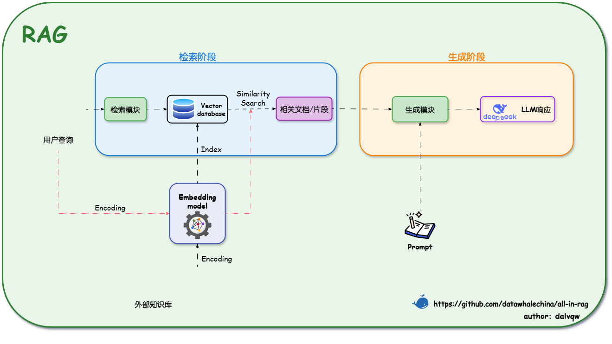
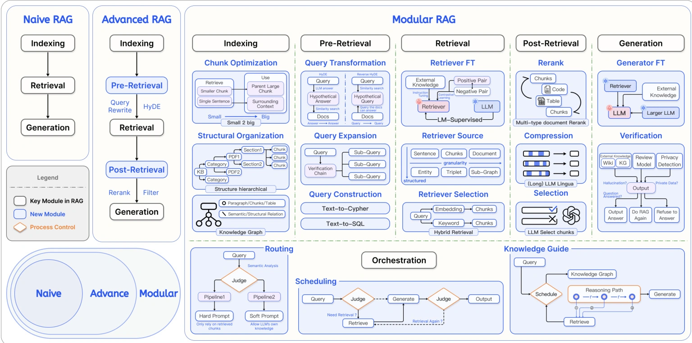

## 1.1 RAG 架构



### 1.1.3 技术演进分类

以下两个分类为学习重点：

**高级RAG**
- 加数据清洗流程
- 元数据优化
- 多轮检索策略
- 提升准确性和效率

**模块化RAG**
- 灵活集成搜索引擎
- 强化学习优化
- 知识图谱增强
- 支持复杂业务场景



### 1.2.1 解决LLM的核心局限
思考：如何使用RAG来解决LLM的幻觉问题？ 

教程内容表述如此-基于检索内容生成，错误率降低， 降低幻觉现象：通过提供具体参考材料，减少无中生有的情况。实际上LLM作为一个有限模型，权重不可能全能，所以对它“不理解“或者训练不足的情况下可能存在幻觉，因此，LLM只是一个工具，而RAG才是应用的主体。

### 1.3.1 基础工具链选择
**框架工具**
- LangChain：提供预置RAG链（如rag_chain），支持快速集成LLM与向量库
- LlamaIndex：专为知识库索引优化，简化文档分块与嵌入流程

**向量数据库**
- Milvus：开源高性能向量数据库
- FAISS：轻量级向量搜索库
- Pinecone：云服务向量数据库


### 1.3.4 进阶调优方向
问题: 如何评估质量，如何优化性能
- 检索质量：上下文相关性（Context Relevance）
- 生成质量：答案忠实度（Faithfulness）、事实准确性
思考：如何从软件测试的角度来验证RAG的效果？


### 2.4.2 Miniconda
使用conda的python来导入模块有一些错误码。
```sh
pip install -r requirements.txt
```

## 3 四步构建RAG
在运行代码之前，需要手动导入模块。很可能和第二节里pip导入安装有关。

## 练习
更改了RecursiveCharacterTextSplitter的参数 chunk_size, chunk_overlap 进行搜寻测试
- 如果不使用参数，也就是使用默认参数 1000，200，大模型能找出6个答案
- 如果使用建议的参数 1024，128，大模型能找出11个答案
- 如果使用参数 2048，256，大模型能找出7个答案
- 如果使用参数 100，20，大模型能找出2个答案，说明embedding模型无法按照语义建立有效建立向量库。


## 讨论

### RAG的Text splitting和transformer里的tokenize有什么异同。
相关但不等同：RAG中的“text splitting”（文本切块/分块）是信息检索与索引阶段的工程策略，而Transformer里的“tokenize”（分词/标记化）是模型输入阶段的底层预处理步骤；通常在做分块时会借助“tokenize”的结果来按标记数控制块大小，但两者目的与粒度不同。

Text splitting：把长文档切成便于检索与重排的小段，以提升召回相关性与减少无关噪声；常结合重叠窗口、句/段落/语义边界、结构标签等策略。

Tokenize：把字符串转成模型词表里的token序列，保证模型长度约束、位置编码与embedding索引可用；不关心检索粒度与文档结构设计。

关系与依赖
分块的“度量尺”常用token数而非字符数或字数，因为向量化与生成都受模型上下文窗口按token计数的硬约束；因此切块器会调用tokenizer来估算每块token长度，避免超过阈值并设置重叠。但分块的“边界选择”不由tokenizer决定：是按句读、段落、语义转折、标题层级、版面结构或跨段语义连贯等策略来定；tokenizer仅提供计数。

粒度与阶段差异
阶段：分块发生在索引前（embedding与入库前），tokenize发生在模型推理前（embedding模型与生成模型各自的tokenizer）。

粒度：分块单位通常远大于token（句/段/节）；tokenize的单位是子词/字节对/字符片段。

多模型场景：用于embedding的tokenizer与用于生成的tokenizer可能不同，故“分块按token计数”应基于实际用于embedding或检索的那一侧tokenizer以避免长度估计失真。

实务建议
以“目标模型的上下文限制”为上限，用对应tokenizer估算分块大小，并保留适度重叠（例如10–20%）以缓解跨块语义断裂。

对结构化/层级文档优先采用结构感知或语义感知分块，再用token计数做“封顶裁剪”，而不是只按固定字符数切。
若检索经常丢失关联信息，考虑语义分块、跨段聚合或后处理重排，而不是单纯增大块长（避免引入噪声与降低密度）。

总结：
- Splitting决定“怎么切、切多大、切在哪”
- tokenize提供“按模型视角精确计量多大”的标尺与编码入口。


